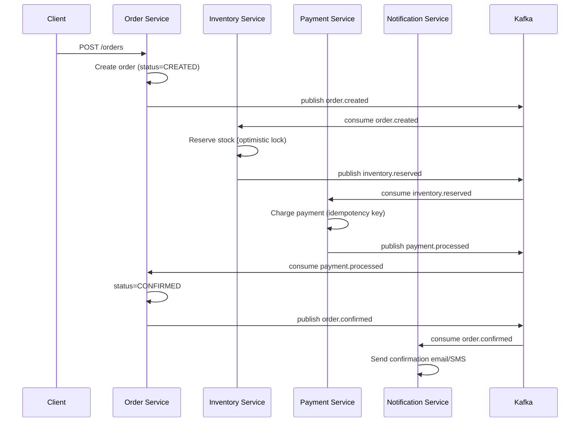
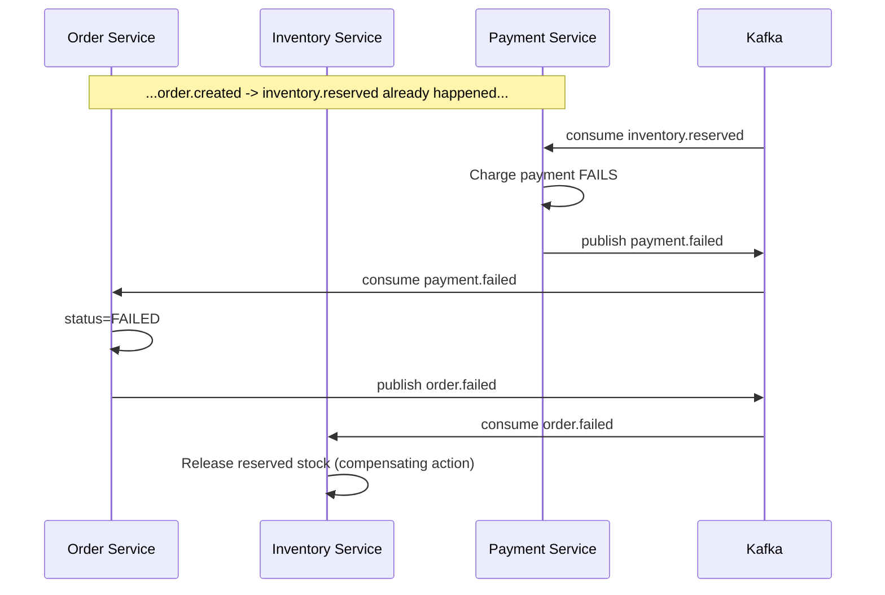

# Order Flow — Saga (Choreography via Kafka)

## Happy path



## Failure / compensation path (payment fails)



## Order status state machine

```
CREATED ──► INVENTORY_RESERVED ──► PAYMENT_PENDING ──► CONFIRMED
   │                │                     │
   └────────────────┴─────────────────────┴──► FAILED (compensated)
```

## Why choreography over orchestration

We're using event choreography (each service reacts to events and publishes the next one)
rather than a central orchestrator, to keep services decoupled and avoid a single point of
failure/bottleneck in a learning-focused project. Trade-off: harder to trace a single order's
journey without distributed tracing — which is exactly why we add Zipkin/Sleuth in Week 3.
If this were a larger real-world system with many more steps, an orchestrator
(e.g. Camunda, or a custom Order Saga coordinator) would likely be easier to reason about
and debug — worth mentioning as a trade-off in interviews.
